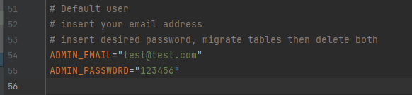

# Laravel Delivery App
###### By Amir Shaw

---
A Package delivery Application made using the Laravel framework in PHP.
### Important Requirements needed to run Laravel 

- Installed Local Server ( This demo uses XAMPP Apache + MariaDB + PHP + Perl) <- It's better to get the all-in-one package. [To XAMP](https://www.apachefriends.org/download.html)
- Installed Composer [To Composer](https://getcomposer.org/) -Check this in a terminal (Command Prompt(CMD)) with:
```html
  composer -v (if this does not work - ensure the PATH variable has the directory of the installed 'composer') 
```
- Installed Laravel dependencies (After composer works with the above command)-> composer needs to download laravel installer; this can be done with this command: 
```html
composer global require laravel/installer
```
- Once this has installed, All we need is an IDE (Integrated Development Environment) to work with the development of the App was done in PHPStorm, though you can use a free IDE called Visual Studio Code.
---
## Each step has a visual aid for your convenience

---
### Cloning from GitHub:
Certain steps are needed before the application will work for you. Follow the steps and the application will work for you.

## Step One 
#### Create a new file and name it ".env". [Create new File Demo](https://gyazo.com/de0e13646811bdb3d37094b1ffae55ee)
To get this simply create a new file and name it .env.

## Step Two
#### (Bottom directory) Copy everything in .env.example and paste it (all) within the newly created .env file. [Copy .env.example file data into .env](https://i.gyazo.com/6fd7ba1e2af936c1a9045f1d1bc60027.mp4)

## Step Three
#### Set an ADMIN_EMAIL AND ADMIN_PASSWORD
Remember your account as when you run the next coming steps - This will be the username and password for the Application. This is Application is Local so make a test email, better to keep it short, in the example test@test.com is the test email.


## Step Four
#### Create Database [Local database Creation](https://i.gyazo.com/f9326a83ed343d6eb3fdafaf272914c2.mp4)
You must create a database in your local server. For the application "ssdelivery" is used, but this can be called anything.

## Step Five
#### Add Database name and local server login details into the .env file. [Modifying .env Database Configuration setting](https://i.gyazo.com/2aa90cccfa9492ff659f729defaabe6d.mp4)
This is needed to connect to the local server database.

## Step Six  ( Using the TERMINAL ) 
#### Generate a Session Key by typing the below command, this is to generate an App key; this only needs to be done when cloning the app. [Generating an APP_KEY](https://i.gyazo.com/9cccba92a46daaede169aac506606e24.mp4)
```html
php artisan key:generate     <-this can be copied and pasted (ensure no spaces before or after.)
```

## Step Seven
#### Get Vendor Folder [Build Vendor Folder](https://i.gyazo.com/20b723bba62f0c1f0c5e163c9054cf6d.mp4)
```html
composer install             <-this can be copied and pasted (ensure no spaces before or after.)<-this can be copied and pasted (ensure no spaces before or after.)
```
This will get the packages that the application needs in order to work. 

## Step Eight

####Run the appropriate migrations to correctly initialise the database [Run the database migration](https://i.gyazo.com/928fe010f4912a5bb28457d0be35ce5b.mp4)
```html
php artisan migrate          <-this can be copied and pasted (ensure no spaces before or after.)
``` 

## Final Step - Running the Application [Running the Server](https://i.gyazo.com/6331b860a830321e31b367661f32348d.mp4)

```html
php artisan serve            <-this can be copied and pasted (ensure no spaces before or after.)
```
You can CTRL left-click on the link in the terminal to open up the application. Or copy the link below and paste it into your URL search
```html
http://127.0.0.1:8000
```

---
#Final Notes:
###### If you have any errors, relate back to the steps and ensure that all steps are correctly followed. Including everything in the 'Important Requirements'
###### Use the ADMIN_EMAIL & ADMIN_PASSWORD set in the .env as the login(check env. if your account is missing - update EMAIL/PASSWORD for ADMIN) for the admin panel, function has been made to read the config 'env.' file and use that as the default admin account.


###### Everything that can be interacted with including the admin dashboard and all 'views and functions have been created by myself. The 'Laravel' framework only provides a foundation to build upon. 

###### Conclusion PHP is one of the best languages I have personally used. The polymorphic nature is just unseen, and the syntax is easily understood. Laravel provides amazing packages that help developers build progressing enterprise application with ease and great security.
###### This application just touches the surface of what 'Laravel' can fully provide. 


##### Feel free to take the application and mess with it. Use it to get to know PHP and the MVC design pattern. 
